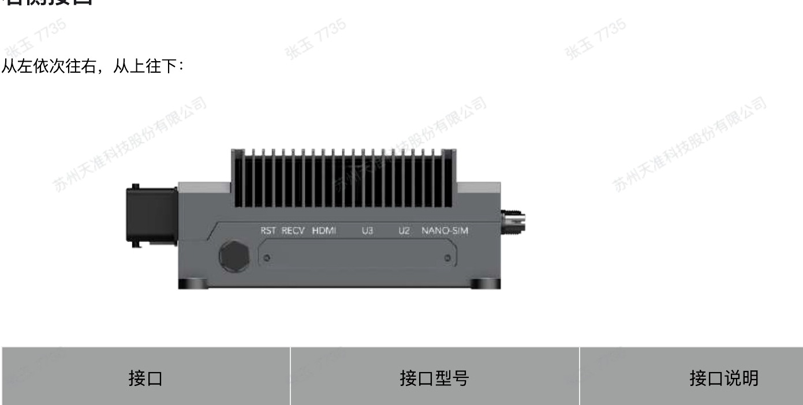

# GEACX1: полный комплект восстановления JetPack 7.2

**Для GEACX1 / AGX Orin 32 ГБ / 510JX0 r3.0. Компьютер для запуска: Ubuntu 24.04, Intel или AMD.**

[**Скачать весь проект ZIP**](https://github.com/tehblok/geacx1-recovery-validation/archive/refs/heads/main.zip) · [**Инструкция с картинками — PDF**](docs/GEACX1-GUIDE-RU.pdf) · [Руководство производителя](docs/GEACX1-MANUFACTURER-MANUAL.pdf)

Репозиторий публичный: скачивание доступно без регистрации и входа в GitHub.
Можно пользоваться обычной кнопкой **Code → Download ZIP**. ZIP проекта содержит
все данные прошивки; дополнительные файлы с сайта производителя скачивать не нужно.
Размер скачивания — примерно **3,7 ГБ**. Интернет на Ubuntu потребуется для установки
системных инструментов через APT.

## Запуск

1. Скачайте ZIP и распакуйте его **на Ubuntu** через «Извлечь сюда».
2. Откройте распакованную папку проекта, где лежит **START.sh**, в терминале.
3. Выполните одну команду:

```bash
bash START.sh
```

Запускайте от обычного пользователя. Основной мастер сам запросит пароль sudo.
Подготовка проверит части данных, соберёт исходный архив и проверит распакованные
файлы. По умолчанию комплект появится в **~/geacx1-kit-v1.2**. Затем откроется мастер.

В мастере выберите **1 — восстановление с нуля**, затем eMMC, NVMe или оба накопителя.
Этот сценарий рассчитан на не загружающуюся плату: рабочая старая Ubuntu не нужна.
Запись на выбранный накопитель начинается только после отдельного подтверждения.

Рабочий диск компьютера — **ext4**. Желательно иметь **100–120 ГиБ свободно** для
одного накопителя, около **180 ГиБ для обоих**. После распаковки комплекта для
подготовки прошивки должно оставаться не менее **80 ГиБ**.

Если комплект уже распакован, для повторного запуска используйте:

```bash
bash "$HOME/geacx1-kit-v1.2/geacx1-recovery/START.sh"
```

Начальный скрипт намеренно не перезаписывает существующую папку. Для новой копии
можно указать другую папку на ext4: `bash START.sh --destination /путь/новая-папка`.

## Инструкция и подключение

[Инструкция с картинками — PDF](docs/GEACX1-GUIDE-RU.pdf) лежит и внутри ZIP в папке
**docs**. Там же есть автономный **GEACX1-GUIDE-RU.html**, который открывается в браузере
без интернета, и полный оригинальный PDF производителя.



Изображение: руководство производителя GEACX1, страница 22. Порядок кнопок Recovery
и нужный USB-разъём показаны в подробной инструкции.

## Что внутри

- Проверенный комплект **v1.2**: BSP производителя, NVIDIA R39.2.0 rootfs, загрузчики,
  ядро, драйверы и русскоязычный мастер с backup/restore.
- **payload/** — данные полного архива. Скрипт собирает их автоматически: вручную
  переименовывать или объединять файлы не нужно.
- **manufacturer-extra/** — дополнительные исходные пакеты производителя. После
  подготовки их исходные DEB-файлы также будут в `~/geacx1-kit-v1.2/manufacturer-extra/`.
  Пакеты JP6.0, JP4.4/NX и CPLD сохранены для полноты исходников и **не устанавливаются
  сценарием JP7.2**. Не устанавливайте пакеты от другой версии JetPack поверх JP7.2.
- **docs/** — инструкция с картинками и оригинальное руководство.
- **recovery/** и **ci/** — исходники и тесты для проверки на GitHub. Пользовательский
  запуск выполняется через **START.sh в корне проекта**.

CUDA, cuDNN, TensorRT и полный пакет nvidia-jetpack устанавливаются после успешной
загрузки платы с проверкой совместимости. Они не входят в базовый образ восстановления.

Логи мастера по умолчанию: `~/geacx1-kit-v1.2/geacx1-recovery/logs/`.
Отчёт распаковки: `~/geacx1-kit-v1.2/unpack-verification.log`.

## Проверки

[Исходный прогон GitHub Actions](https://github.com/tehblok/geacx1-recovery-validation/actions/runs/36914247252)
подтвердил 68 тестов, 10 аварийных сценариев backup/restore, установку зависимостей
в чистой Ubuntu 24.04 x86_64 и запуск восьми утилит NVIDIA.
Новый сценарий CI также проверяет подготовку комплекта и все загруженные части.

Физическая прошивка, чтение и восстановление накопителей и загрузка этой платы
на GitHub не выполняются. Журналы CI сохраняются как artifact `geacx1-ubuntu24-evidence`.

SHA-256 неизменённого полного архива v1.2:
`248b91f6165b3a24d05f9944f358dd8d4954aee3bd705b0ea78251c3ba3c7bb0`.

Файлы NVIDIA и производителя сохраняют исходные лицензии и уведомления.
